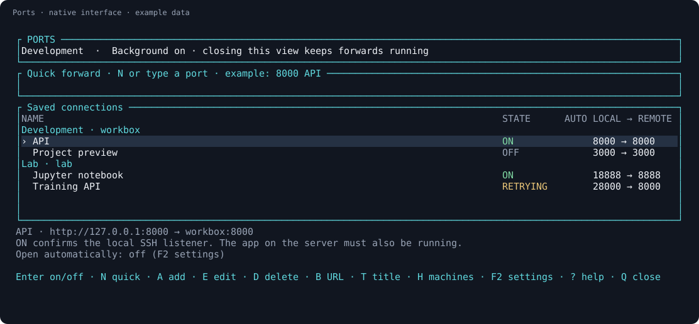

# Ports

**SSH forwards you can save, control from any tab, and leave running.**

Keep dev servers, notebooks, and dashboards from several machines in one
keyboard-driven list. Reopen a favorite with Enter, choose another local port
when one is busy, and reconnect after network interruptions—even with the
terminal closed.

[](https://github.com/brant92good/port-forward-tui/actions/workflows/native.yml)
[](docs/verification.md)
[](LICENSE)

[Install](#install) · [First connection](#first-connection) · [Agent commands](#commands-for-your-agent) · [How it works](docs/reference.md)

> Development: opt-in automatic opening is being qualified for v0.8.0.
> The install commands below use published v0.7.3; macOS remains beta.
> [What was tested](docs/verification.md).



*Native widgets rendered with example machines and connection states.*

## Install

Windows, in PowerShell:

```powershell
irm https://raw.githubusercontent.com/brant92good/port-forward-tui/v0.7.3/install.ps1 | iex
ports
```

Linux or macOS **beta**:

```sh
curl -fsSL https://raw.githubusercontent.com/brant92good/port-forward-tui/v0.7.3/install.sh | sh
```

Open a new terminal and run `ports`.

The installer downloads a compiled app and checks its SHA-256 digest. Normal
use needs **OpenSSH**, with no Python, Rust toolchain, or Git installation.
Choose a machine after installation: **A** adds an SSH name or `user@address`;
**I** previews names from your SSH config for import.

Want a remote tab, Ports, local sessions, and return shortcuts together?
[Terminal Workspace](https://github.com/brant92good/terminal-workspace) adds that
Windows integration. Ports also runs independently in your current terminal.

## First connection

If you normally connect with `ssh workbox`, add or import `workbox`. Your SSH
login must work without a password prompt before Ports can run it in the
background. [Setup help](docs/getting-started.md) covers first-time login.

1. Run your app on the server, for example on port **8000**.
2. In Ports, type **`8000`** and press **Enter**.
3. When the row is **ON**, press **B** to open its local HTTP address.

Need local port 18000 instead? Enter **`18000:8000 API`**. A single number uses
the same port on both computers. **A** opens separate fields; **N** focuses
quick entry; **E** edits the selected favorite.


*The A form. [N quick entry](docs/screenshots/quick-forward.svg) accepts a port
directly in the main view.*

## Who is this for?

- You switch between remote projects and keep reconstructing the same `ssh -L` commands.
- Your dev servers and notebooks live on several machines.
- You want forwards to survive closing a tab or the entire terminal.
- You want a coding agent to manage the same saved connections through inspectable commands.

## A few keys cover the daily work

| Key | Action |
| --- | --- |
| ↑ / ↓, then Enter or Space | Select a favorite and start/stop it |
| N / A | Quick entry / add and connect using a form |
| E / D | Edit / delete a favorite |
| B / R | Open its HTTP address / reconnect now |
| H | Add, import, or select machines |
| Q | Close this view; background forwards continue |
| S | Stop forwards and pending retries on all listed servers |
| F2 | Settings: open this favorite automatically, or choose return-shortcut scope |
| ? | Full keyboard guide |

The selected row determines which machine receives a new forward. Each view
keeps its own selection, while favorites and connection state stay shared.
Conflicting edits are rejected so one view cannot silently overwrite another.

To bring up the same dev environment each day, select a favorite, press **F2**,
enable **Open automatically** with Space, and press Enter to save. It is off by
default. A new Ports view opens opted-in favorites across its listed machines;
running connections keep their existing processes. `--foreground` applies only
to its selected machine.

After opening completes, Stop keeps a connection off through refresh. Opening
a new view applies the preference again. **QUEUED** means it has not started yet:
Enter cancels that item, **S** cancels this view's remaining queue and stops
listed forwards, and **Q** cancels its unsent items before closing. Changing this setting
does not immediately start or stop anything.

## When your connection drops

Started forwards retry recoverable failures after **2, 4, 8, 16, then at most
30 seconds**. Stop a row to cancel its retries. Authentication, host-key, and
occupied-port errors need attention. OFF favorites stay OFF unless you start
them or open a new view with **Open automatically** enabled for them.

Closing the terminal leaves the background controller running. Rebooting or
signing out ends it. **ON** confirms that SSH owns the local listener; the remote
app still needs to be running. [Recovery and updates](docs/recovery.md).

## Commands for your agent

```sh
ports doctor --json
ports machines list --json
ports save --machine MACHINE_ID --remote 8000 --name API --json
ports start FAVORITE_ID --machine MACHINE_ID --json
ports auto-open FAVORITE_ID --machine MACHINE_ID --on --json
```

Use IDs returned by the previous command. `save` records a favorite; `start`
opens it. `auto-open --on` saves the new-view preference; `--off` disables it.
Neither changes the current connection state. JSON results distinguish ON, CONNECTING, RETRYING, ERROR, and unobserved
status. [CLI contract](docs/automation.md) · [Agent instructions](AGENTS.md).

## Evidence, scope, and contributing

Native tests exercise actual local controller requests, competing edits,
owned SSH-shaped processes and their descendants, recovery, and keyboard flows
in an OS pseudo-terminal. Published results separate those checks from real
OpenSSH and desktop testing. [Verification details](docs/verification.md).

Ports handles local TCP forwarding. It does not transfer files, provide remote
or dynamic SOCKS forwarding, or start your remote app. For one temporary forward,
plain `ssh -L` is often enough.

[Report a problem](https://github.com/brant92good/port-forward-tui/issues) ·
[Build and architecture](docs/reference.md) · [MIT license](LICENSE)
