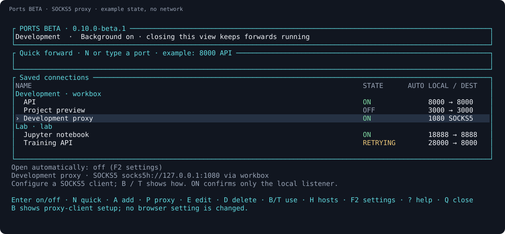
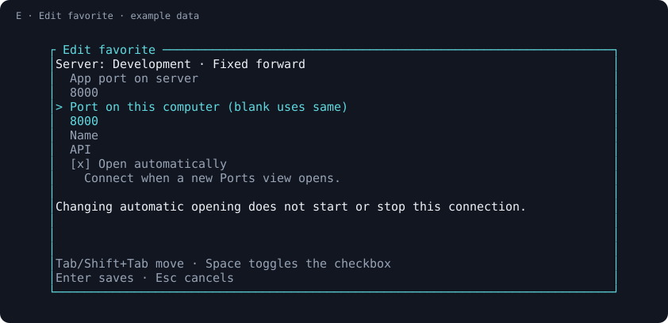
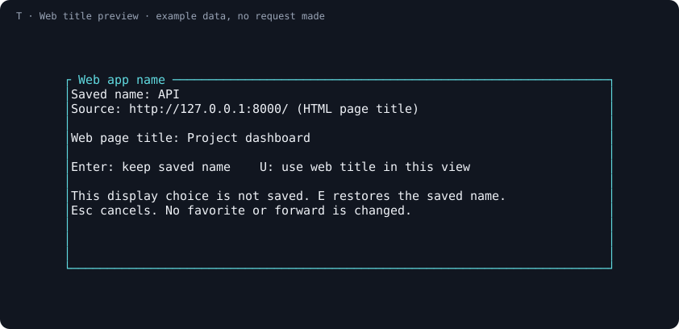

# Ports BETA

**Save SSH forwards and SOCKS5 proxies, control them from any tab, and leave them running.**

Keep dev servers, notebooks, and dashboards from several machines in one
keyboard-driven list. Reopen a favorite with Enter, choose another local port
when one is busy, and reconnect after network interruptions—even with the
terminal closed.

[](https://github.com/brant92good/port-forward-tui/actions/workflows/native.yml)
[](docs/verification.md)
[](LICENSE)

[Install](#install) · [First connection](#first-connection) · [SOCKS5 guide](docs/socks.md) · [Agent commands](#commands-for-your-agent)

> **0.10.0-beta.1 source candidate:** SOCKS5 is a separate beta channel with its
> own command, data and controllers. It does not upgrade the existing `ports`
> installation. Qualification and beta downloads are not yet claimed here.
> The [published 0.9.1 baseline](https://github.com/brant92good/port-forward-tui/blob/v0.9.1/README.md#install)
> remains available without SOCKS. macOS remains beta.
> [What was tested](docs/verification.md).


*Native widgets rendered with example machines and connection states.*

## Install

### Try the beta

These commands target **0.10.0-beta.1**. Use them after its
[versioned release](https://github.com/brant92good/port-forward-tui/releases/tag/v0.10.0-beta.1)
and actual-download checks are available; the source-candidate notice above
does not claim that those gates have passed.

Windows PowerShell 5.1 or 7:

```powershell
$installer = Join-Path $env:TEMP 'ports-beta-0.10.0-beta.1-install.ps1'
Invoke-WebRequest -UseBasicParsing https://raw.githubusercontent.com/brant92good/port-forward-tui/v0.10.0-beta.1/install.ps1 -OutFile $installer
& $installer -Channel beta -Version 0.10.0-beta.1
& "$env:LOCALAPPDATA\Programs\PortsBeta\bin\ports-beta.exe"
```

Linux or macOS **beta**:

```sh
curl -fsSL https://raw.githubusercontent.com/brant92good/port-forward-tui/v0.10.0-beta.1/install.sh |
  PORTS_CHANNEL=beta PORTS_VERSION=0.10.0-beta.1 sh
"${XDG_DATA_HOME:-$HOME/.local/share}/ports-beta-install/bin/ports-beta"
```

The full path is intentional: beta does not change PATH or replace the stable
`ports` command. Its data lives in `PortForwardTUI-Beta` under the platform's
local data directory. Choose a machine after installation, or explicitly
[copy stable metadata into a new beta directory](docs/automation.md#configuration-and-integration).
No connections or automatic-opening choices are imported. To return to stable,
use the original `ports` command and its unchanged data.
[Versions, compatibility and rollback](docs/versioning.md).

### Keep the published baseline

The following commands install **0.9.1**, which has fixed forwards only.
Do not point the beta at existing stable data.

Windows, in PowerShell:

```powershell
irm https://raw.githubusercontent.com/brant92good/port-forward-tui/v0.9.1/install.ps1 | iex
ports
```

Linux or macOS **beta**:

```sh
curl -fsSL https://raw.githubusercontent.com/brant92good/port-forward-tui/v0.9.1/install.sh | sh
```

Open a new terminal and run `ports`.

Developers can build the beta checkout with `cargo build --locked` and invoke
`target/debug/ports` (`.exe` on Windows). That source-built executable already
uses the isolated `PortForwardTUI-Beta` data directory. Packaged beta installs
use the distinct `ports-beta` executable. In examples below, `ports-beta` is
shorthand for the full installed path shown above; it is not added to PATH.
For source testing, substitute the exact source-built path instead.

The installer downloads a compiled app and checks its SHA-256 digest. Normal
use needs **OpenSSH**, with no Python, Rust toolchain, or Git installation.
Choose a machine after installation: **A** adds an SSH name or `user@address`;
**I** previews names from your SSH config for import.

Want a remote tab, Ports, local sessions, and return shortcuts together?
[Terminal Workspace](https://github.com/brant92good/terminal-workspace) adds that
Windows integration. Ports also runs independently in your current terminal.

## First connection

If you normally connect with `ssh workbox`, add or import `workbox`. Your SSH
login must work without a password prompt before Ports can run it in the
background. [Setup help](docs/getting-started.md) covers first-time login.

1. Run your app on the server, for example on port **8000**.
2. In Ports BETA, type **`8000`** and press **Enter**.
3. When the row is **ON**, press **B** to open its local HTTP address.

Need local port 18000 instead? Enter **`18000:8000 API`**. A single number uses
the same port on both computers. **A** opens separate fields; **N** focuses
quick entry; **E** edits the selected favorite.

For several destinations through the same server, press **P** to add a SOCKS5
proxy. Choose a free local port (default **1080**), give it a name, and save to
connect. Configure a SOCKS-aware client to use it; **B** shows setup guidance.
There is no fixed remote port because each client request chooses its destination.



If local port 8765 is busy but the server app uses 8765, a fixed forward
`18765:8765 API` is enough for that app. SOCKS is useful when the client needs
several destinations. [A worked example, DNS and browser caveats](docs/socks.md).


*The A form. [N quick entry](docs/screenshots/quick-forward.svg) accepts a port
directly in the main view.*

## Who is this for?

- You switch between remote projects and keep reconstructing the same `ssh -L` commands.
- Your dev servers and notebooks live on several machines.
- You want forwards to survive closing a tab or the entire terminal.
- You want a coding agent to manage the same saved connections through inspectable commands.

## A few keys cover the daily work

| Key | Action |
| --- | --- |
| ↑ / ↓, then Enter or Space | Select a favorite and start/stop it |
| N / A | Quick entry / add a fixed forward and connect |
| P | Add a SOCKS5 proxy and connect |
| E / D | Edit / delete a favorite; Edit preserves its type |
| B / R | Fixed forward: open HTTP; proxy: client setup / reconnect now |
| T | Fixed forward: preview HTML title; proxy: client setup only |
| H | Add, import, or select machines |
| Q | Close this view; background forwards continue |
| S | Stop forwards and pending retries on all listed servers |
| F2 | Settings: open this favorite automatically, or choose return-shortcut scope |
| ? | Full keyboard guide |

Servers are group headings; each selectable row starts with the favorite's
name, followed by its mapping and state. The selected row determines which
machine receives a new forward. Each view
keeps its own selection, while favorites and connection state stay shared.
Conflicting edits are rejected so one view cannot silently overwrite another.

To bring up the same dev environment each day, select a favorite, press **E**,
Tab to **Open automatically**, toggle it with Space, and press Enter to save.
F2 settings offers the same preference. It is off by
default. A new Ports view opens opted-in favorites across its listed machines;
running connections keep their existing processes. `--foreground` applies only
to its selected machine.

After opening completes, Stop keeps a connection off through refresh. Opening
a new view applies the preference again. **QUEUED** means it has not started yet:
Enter cancels that item, **S** cancels this view's remaining queue and stops
listed forwards, and **Q** cancels its unsent items before closing. Changing this setting
does not immediately start or stop anything.



Changing only the checkbox leaves the current connection alone. Changing a
running favorite's port or name retains the usual edit-and-restart behavior.
This also applies to SOCKS proxies. Edit changes their local port and name;
it does not convert them into fixed forwards. Delete and add a different type
when that is what you want.

## Recognize a web app

Select an **ON fixed-forward** row and press **T** to read one HTML page from its local address.
The preview shows both your saved name and the page's title. **U** uses that title
in this view; **Enter** keeps your saved name. **E** restores the saved name.
Nothing is renamed on disk, and Ports never runs this check automatically.



This reads a web page's self-reported title, not the remote process name.
The check accepts a small UTF-8 HTTP page with a 1.5-second request limit.
It does not follow redirects, log in, use HTTPS, or run JavaScript; APIs and
other services may have no title. Your own names work for every kind of forward.
For SOCKS rows, both **B** and **T** show client setup without sending HTTP or
opening a browser. Ports does not change OS or browser proxy settings.

## When your connection drops

Started forwards retry recoverable failures after **2, 4, 8, 16, then at most
30 seconds**. Stop a row to cancel its retries. Authentication, host-key, and
occupied-port errors need attention. OFF favorites stay OFF unless you start
them or open a new view with **Open automatically** enabled for them.

Closing the terminal leaves the background controller running. Rebooting or
signing out ends it. **ON** confirms that SSH owns the local listener; the remote
app still needs to be running. [Recovery and updates](docs/recovery.md).

## Commands for your agent

```sh
ports-beta doctor --json
ports-beta machines list --json
ports-beta save --machine MACHINE_ID --remote 8000 --name API --json
ports-beta save --machine MACHINE_ID --socks --local 1080 --name "Dev proxy" --json
ports-beta start FAVORITE_ID --machine MACHINE_ID --json
ports-beta auto-open FAVORITE_ID --machine MACHINE_ID --on --json
```

Use IDs returned by the previous command. `save` records a favorite; `start`
opens it. `auto-open --on` saves the new-view preference; `--off` disables it.
Changing that preference does not start or stop the current connection. JSON
results distinguish ON, CONNECTING, RETRYING, ERROR, and unobserved status.
Beta JSON uses schema version **2** and includes `channel: "beta"` and the
app version. Proxy rows explicitly have `kind: "socks"`, no `remote_port`,
and a `socks5h://127.0.0.1:PORT` endpoint. `--socks` and `--remote` are mutually
exclusive. Stable controllers are never reused by the beta.
[CLI contract](docs/automation.md) · [Agent instructions](AGENTS.md).

## Evidence, scope, and contributing

Native tests exercise actual local controller requests, competing edits,
owned SSH-shaped processes and their descendants, recovery, and keyboard flows
in an OS pseudo-terminal. Published results separate those checks from real
OpenSSH and desktop testing. [Verification details](docs/verification.md).

This beta handles fixed local TCP forwards and OpenSSH SOCKS5 proxies. It does
not transfer files, offer reverse forwarding, carry UDP or turn the whole device
into a VPN. Only clients configured to use the proxy go through it. Ports never
starts the remote app. For one temporary forward, plain `ssh -L` is often enough.

[Report a problem](https://github.com/brant92good/port-forward-tui/issues) ·
[Build and architecture](docs/reference.md) · [MIT license](LICENSE) ·
[Dependency notices](docs/licenses/README.md)
