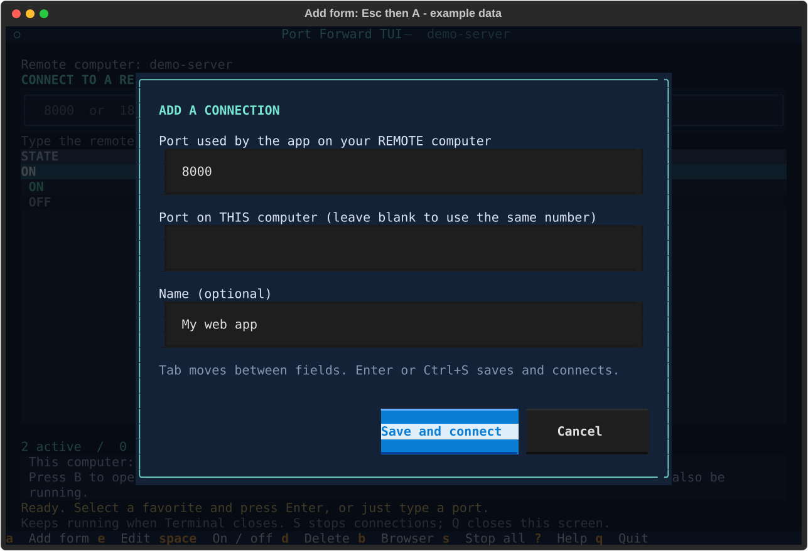

# First connection walkthrough

This guide starts with a remote computer you have permission to access. Run the commands in Windows PowerShell inside Windows Terminal.

[Back to the README](../README.md) · [Commands for agents](automation.md)

## Ports and SSH


- **Port:** the number in an app address. In `http://localhost:8000`, it is `8000`.
- **Remote computer:** the server or workstation where your app is running.
- **Local / this computer:** the Windows computer where you want to open it.
- **SSH:** the login connection used to reach your remote computer securely.
- **Forward / tunnel:** the connection that carries traffic from a port here to
  a port on the remote computer. A **favorite** saves its name and port numbers.
- **TUI:** a text-based app inside a terminal. All its controls work by keyboard.

An AI coding agent can help with setup. You still need the server's address,
your login name, and permission to connect to it. Your agent should ask for
missing details rather than guess them.

## Set up

Run these commands in a **PowerShell tab inside Windows Terminal**, on Windows.

| Needed | How to get it / check it |
| --- | --- |
| Windows Terminal | Install it from Microsoft Store. |
| Git | Install [Git for Windows](https://git-scm.com/downloads/win); `git --version` should work. |
| Windows Python 3.12 or newer | Install [Python](https://www.python.org/downloads/windows/), or use an existing compatible Conda installation. |
| Windows OpenSSH Client | Windows Settings → Optional features → OpenSSH Client. `ssh -V` should work. |
| A working SSH login | Follow the short walkthrough below if you do not already have one. |

**1. Prepare a remote login (needed before starting forwards, not before installation).** If you normally run `ssh workbox`, then
`workbox` is your **SSH name**. Examples here use that name; replace it with yours.

```powershell
ssh workbox
```

If you have an address and username instead, try `ssh yourname@server-address`.
The first connection may ask you to confirm the server's identity; verify it
with its owner. Type `exit` when you have confirmed that login works.

For a short name, you can add a block to `%USERPROFILE%\.ssh\config`
(preserve any existing entries):

```sshconfig
Host workbox
    HostName server-address
    User yourname
```

Background connections cannot ask you for a password. Set up an SSH key, and
load a passphrase-protected key into Windows `ssh-agent` if needed. Microsoft's
[Windows SSH key guide](https://learn.microsoft.com/en-us/windows-server/administration/openssh/openssh_keymanagement)
walks through that step.

**2. Download and install.** Choose a folder you will keep; shortcuts point to it.

```powershell
git clone https://github.com/brant92good/port-forward-tui.git
cd port-forward-tui
.\install.ps1
.\open.ps1
```

On first launch, press A to add a machine
or I to preview and import SSH names. Select a machine with Enter.
See [machines and SSH import](machines.md) for the complete keyboard flow. Setup
installs packages in `.venv` and adds an entry to the Terminal dropdown.

For a particular Python installation:
`.\install.ps1 -Python 'C:\path\to\python.exe'`.
Conda activation is only needed to select an environment for setup; shortcuts
then call the private Python directly. Keep the base Python installed.

If Windows blocks the script, inspect it first and, where your organization's
policy permits, use `powershell.exe -NoProfile -ExecutionPolicy Bypass -File .\install.ps1`.
This sets policy for that invocation, not for the whole computer.

## Open your first remote app

1. Make sure the app is running on the **remote** computer. Suppose it uses port 8000.
2. Select a row for the intended server (shown beside **Add to**), then press **Esc**, **A**. Enter `8000` in the remote-port field.
3. Leave the port on this computer blank to use the same number, then press **Enter**.
4. When the row shows **ON**, press **B** to open the local HTTP address in your browser.



*Add form: Esc → A, with example remote port 8000 and name “My web app”.
Tab moves between fields. N opens quick entry; E edits an existing favorite.*

Prefer fewer keystrokes? Just type **`8000` then Enter** in the main screen.
If port 8000 is already used here, type **`18000:8000`** instead: this computer
uses 18000, the remote app still uses 8000, and the browser address becomes
`http://localhost:18000`. A name can follow: `18000:8000 My web app`.

**ON means the SSH connection is listening on this computer.** The remote app
must also be running. The browser shortcut uses HTTP; for HTTPS, a database,
or another protocol, use the appropriate URL or client yourself.

| Key | What it does |
| --- | --- |
| A | Add using a form; Enter saves and connects |
| Type a number, then Enter | Save and connect using the same port on both computers |
| Up / Down, then Enter or Space | Select a favorite and start or stop it |
| E / D | Edit / delete the selected favorite |
| B / R | Open its HTTP address / restart its connection |
| N / Escape | Jump to quick entry / return to the list |
| Q | Close this screen; background connections continue |
| S | Stop all listed servers' connections and retries; favorites stay saved |
| F2 / ? | Shortcut settings / help |

The main list groups all saved machines by server. Press Esc then H to add/import
machines or select one; existing background forwards continue.
Starter favorites are examples and begin OFF. Edit or delete them freely.
Multiple open screens share favorites and connection state. Started forwards
retry network failures automatically, including after Wi-Fi or VPN returns.
RETRYING means another attempt is scheduled; Enter stops it and R retries now.
Login, host-key and occupied local-port errors need your attention. Reboot or
sign-out ends running tunnels; favorites remain saved and OFF next time.

## Something did not work?

```powershell
.\doctor.ps1
```

This prints setup checks and suggested fixes.

| What you see | What to do next |
| --- | --- |
| No usable Python | Install Windows Python 3.12+, or pass its real executable with `-Python`. WSL Python cannot run this app. |
| Existing environment is invalid | Restore its base Python, or rename `.venv` as a backup and rerun installation. |
| Permission denied from SSH | Try `ssh YOUR_SSH_NAME` in PowerShell. Check the username, SSH key, and key agent. |
| Server name cannot be found / timeout | Check the SSH name, network, and any VPN the server requires. |
| Local port already in use | Press E and change the port on **this computer**; keep the remote app's port. |
| ON but the page will not open | Confirm the remote app is running and using the expected port/protocol. |

Connections listen on `127.0.0.1`. Favorites are saved in
`%LOCALAPPDATA%\PortForwardTUI\forwards.json`.
