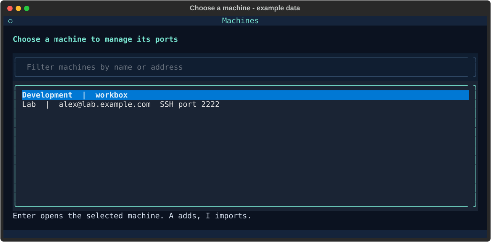

# Machines and SSH import

Installation prepares the app. You can add machines later, and use the port app
with any SSH workflow; Herdr is not required.

## Add or import your first machine

Open the app after `.\install.ps1`. The machine picker appears if you have no
saved machines. Press **A** to add one manually:

- Enter an SSH name such as `workbox`, or a login such as `alex@server.example.com`.
- Give it an optional friendly name.
- Leave the SSH login port blank to use your SSH configuration (normally 22).
  This field is separate from your web app's port, such as 8000.
- Press Enter to save and open its port manager. Saving a machine does not log in.

Alternatively press **I** to import from SSH config. The default file is
`%USERPROFILE%\.ssh\config`; you can select a different file. The screen previews
literal `Host` names. Use Up/Down and Space to select names, then Ctrl+S to import.
Choose an imported machine and press Enter to open it.



*Example machines.*

Import reads names from the selected file and its Include files. Wildcards and
negated patterns are not selectable machines.
Conditional includes can contribute names; OpenSSH evaluates their settings
when you connect. Dynamic Include paths using percent tokens are skipped; add
such aliases manually. [OpenSSH documents Host, Include and Match behavior](https://man.openbsd.org/ssh_config).

An imported alias continues using your SSH configuration, including keys and
jump hosts. For a nondefault config file, the app records its path and passes
it to SSH with `-F`. Keep that file in place.

## Manage several servers together

The default screen lists favorites from **all saved servers**, grouped in the
SERVER column. Start connections on several servers at once with Enter. Moving
Up/Down selects both a connection and its server; quick entry and the A form
add to that server, named in **Add to** above the list and in the form itself.
An empty server still has a row so you can select it and add a favorite.

Press **Esc, H** to add/import machines or select a different initial server.
Canceling the picker returns to the list. Each view keeps its own selection;
existing background forwards keep running. S stops all servers in the list,
including pending reconnect attempts. Foreground mode remains a single-machine
view and asks before stopping its connections when you switch machines.

Each machine has separate favorites, connection state and return-shortcut scope
(F2). Two machines can save remote port 8000, but they cannot both listen on the
same local port at once. Use local 18000 for the second connection. A conflict
is reported; the app does not stop another machine's forward to take its port.

With Terminal Workspace, a new workspace window pairs a remote session and
Ports initially selects your chosen machine in the combined list. Selecting a
different server's row changes that tab's remote-shortcut context immediately.
Shortcuts use the last-focused machine view in
the invoking window, then find that machine's most recently focused target tab.
F2 limits that search to this window or allows other windows. In a window with
no known machine context and multiple saved machines, a picker appears.
Opening another workspace keeps existing workspaces and forwards running.

Run `.\open.ps1 --machines` to always show the picker, or
`.\open.ps1 --machine MACHINE_ID` to select that server initially in the list.
`--host workbox` remains available: it adds or opens that destination, rather
than changing the destination of existing favorites.

## Existing installations

Your original `forwards.json`, favorite IDs and running background process stay
in place. The old destination appears as a saved machine automatically. New
machines live below `machines/` inside the same private app-data folder.
No public or private repository is needed to store local machines.

Open fresh app views after upgrading to load machine selection and window
tracking. Already running views keep their loaded code. Closing a background
view does not stop its forwards. Machine destinations are immutable: add a new
machine when its SSH name, login port or config path changes. Do not edit a live
favorites file to redirect its connections.

A running controller keeps its loaded code too. Use
`ports.ps1 restart-manager --machine MACHINE_ID` after updating to enable
automatic reconnect: it briefly stops that server's forwards, loads the new
controller, and restores only its ON/connecting/retrying requests. Saved OFF
favorites stay OFF. See [Updating](../README.md#updating).

## Commands for an agent

```powershell
.\ports.ps1 machines list --json
.\ports.ps1 machines discover --json   # Read names without saving anything
.\ports.ps1 machines import --select workbox --json
.\ports.ps1 machines add alex@server.example.com --name Lab --ssh-port 2222 --json
# Use the machine id returned above:
.\ports.ps1 save --machine MACHINE_ID --remote 8000 --json
.\ports.ps1 list --machine MACHINE_ID --json
```

With multiple saved machines, commands that change connections require
`--machine`; they never guess from another window's most recent use. `list`
without a machine includes all machines and labels their connections. Machine
discovery, import and addition never open an SSH connection. See the
[command guide](automation.md) for start, stop, deletion and JSON details.
