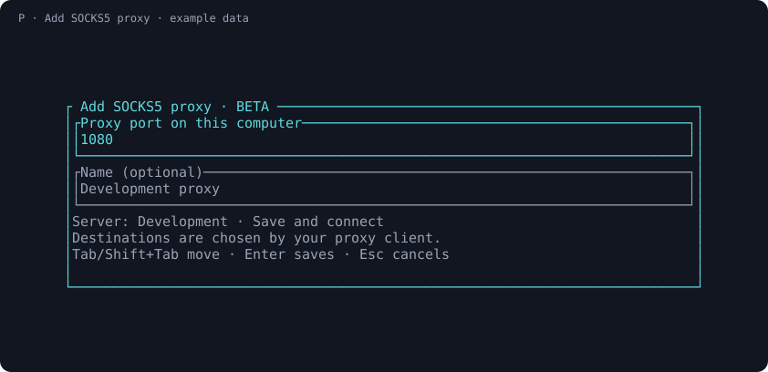
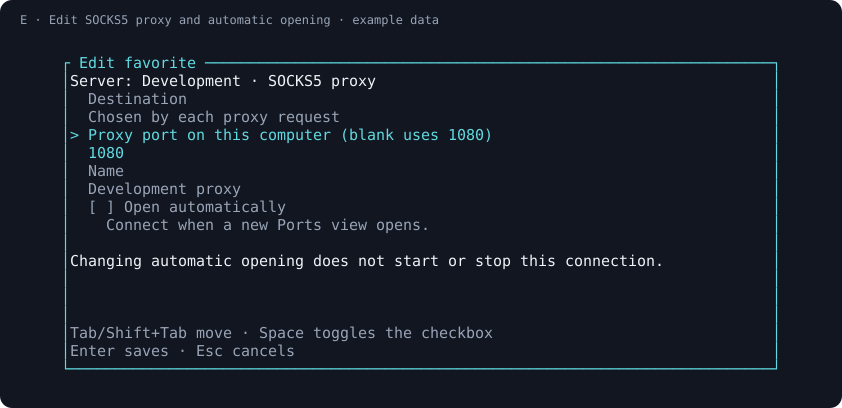

# Use several remote services through one SOCKS5 proxy

[Ports BETA](../README.md) saves an OpenSSH SOCKS5 listener alongside ordinary
fixed forwards. The beta is a separate command and data directory; see
[installation status](../README.md#install). Normal use runs the compiled app
and system OpenSSH, without Python, Cargo or Git.

## Choose a fixed forward or a proxy

Suppose a server app listens on **8765**, but another program already uses 8765
on your computer. For that single app, enter **`18765:8765 API`** in Ports. Its
browser address is `http://127.0.0.1:18765/`; the server app keeps port 8765.

A SOCKS proxy is useful when a configured client needs several destinations
reachable from the same SSH server. Press **P**, choose a free local port
(default **1080**), name the proxy and press Enter to save and connect. It binds
only to `127.0.0.1`; the client supplies the destination for each request.
OpenSSH's `-D` option provides this dynamic forwarding. [OpenSSH ssh manual](https://man.openbsd.org/ssh.1#D)



**E** edits that proxy's local port, name and **Open automatically** checkbox.
It preserves the proxy type. Changing only the checkbox never starts, stops or
restarts a current connection. It defaults off and is applied only when a new
Ports view opens. A running proxy's port or name edit uses the ordinary restart
behavior. **Enter/Space**, **R**, **D** and **S** retain the same start/stop,
reconnect, delete and stop-all meanings as fixed forwards.



## Configure a client, then test a destination

When the proxy row is **ON**, configure your client for **SOCKS5**, host
`127.0.0.1`, port `1080` (or your chosen port). ON confirms only the SSH-owned
local listener. A destination may still be stopped, unreachable or refused by
the server's forwarding policy. Ports does not start the remote application.

For an explicit request to the server's port 8765, use curl:

```sh
curl --socks5-hostname 127.0.0.1:1080 --noproxy no-bypass.invalid http://localhost:8765/
```

On Windows PowerShell use **`curl.exe`** so the command runs curl rather than a
PowerShell alias. Replace the proxy port and destination with yours. The
nonmatching `--noproxy` entry prevents an existing `NO_PROXY=localhost` setting
from silently bypassing this particular test. `--socks5-hostname` sends the
destination hostname to the proxy for resolution; `--socks5` resolves it on
your own computer instead. In this proxied request, destination `localhost`
means the **SSH server**, while proxy `127.0.0.1:1080` is on **your computer**.
[curl options](https://curl.se/docs/manpage.html#--socks5-hostname)

For a browser, use its own documented proxy configuration and consider a
separate profile. Browsers may bypass proxies for `localhost` and loopback
addresses, reaching your own machine even when a proxy is configured. Chromium
documents this implicit bypass behavior. For one server-local web app, a fixed
forward is often simpler. Ports does not change those settings for you.
[Chromium proxy behavior](https://chromium.googlesource.com/chromium/src/+/HEAD/net/docs/proxy.md#implicit-bypass-rules)

## Boundaries

- **B** and **T** on a SOCKS row show client guidance. Neither opens a browser
  nor sends an HTTP title request to the proxy.
- Only proxy-configured clients use the SSH connection. This is TCP forwarding,
  not a whole-device VPN, and it does not carry UDP.
- Remote DNS depends on the client's SOCKS behavior. A proxy setting does not
  guarantee every browser component or other app uses remote DNS.
- Saved names remain your labels. A proxy has no single remote app or fixed
  remote port to name or inspect automatically.
- The beta uses protocol 2 and separate data. It never attaches to a stable
  controller. [Metadata-only import and JSON contract](automation.md#configuration-and-integration)

The screenshots render real widgets with synthetic data and simulated states.
They are not evidence that a remote destination was reached. The separate
[verification record](verification.md) identifies observed test coverage and
release qualification.
